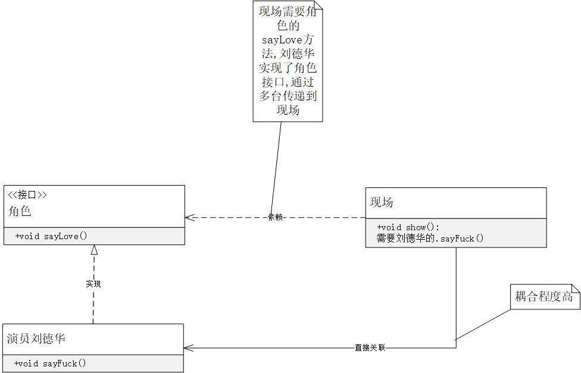
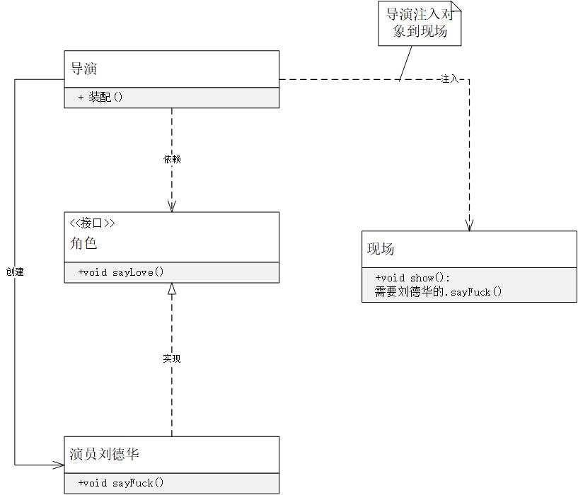
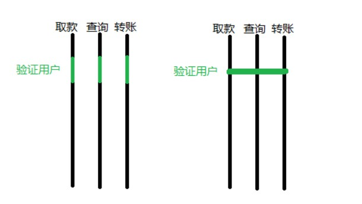
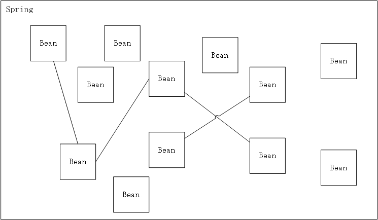

# Spring 之旅,其实就TM名字牛逼一点
- Spring 的Bean容器 
- Spring的核心模块
- 强大的Spring生态系统
- Spring的新功能

## 一.介绍
Spring是一个开源框架,创建的目标就是简化Java开发;

`Spring的特点:`
- 基于POJO的**轻量级**,和**小侵入性**
- 通过**控制反转**和**依赖注入**实现松耦合
- 基于面向切面实现申明式编程
- 通过切面和模板减少样式代码


## 二.激发POJO潜能

1.什么是POJO
- POJO(Plain Ordinary Java Object)普通实体对象
    - 最普通的实体类,不需要继承,实现,或者被打上特定的注解等
    本身不包含业务逻辑代码


2. 什么是JavaBeen
- 也是一种实体类,但是他有较高的耦合性
    - 这个类必须有一个公共缺省的构造函数
    - 这个类的属性必须使用getter和setter来访问,其他方法遵从命名规范
    - 这个类必须是可以被序列化的

**Spring使用的实体类是POJO,并且使用DI(依赖注入)的方式来装配它们**


<br/><br/><br/><br/>
## 三.依赖注入和控制反转
- 这个名字符合Spring的特点,越是低级的技术名字越牛逼;

- **`依赖注入是一种技术,控制反转是一种思想,依赖注入符合控制反转的思想;`**


1. **控制反转(IOC :Inversion of Control)**
```javaScript
    Spring定义一个容器,或者说是一个媒介,没创建一个对象就要在这个容器中注册一下我是谁,我要什么,然后容器把我要人给我,同时也可以把我给其他需要我的人; 

    对象的创建和死亡(丢失引用即为死亡),已经由不得对象本身来控制了,全部都将控制权交给了Spring容器,这又叫做控制反转

    这四个字,强调的是 *控制* 包括创建,执行,死亡;  

```
**=============================普通的高耦合关系===========================**

<br>
**=============================依赖注入的低耦合关系==========================**
<br>

```
 ------Bromon的Blog
Spring所倡导的开发方式就是如此，所有的类都会在spring容器中登记，告诉spring你是个什么东西，你需要什么东西，然后spring会在系统运行到适当的时候，把你要的东西主动给你，同时也把你交给其他需要你的东西。所有的类的创建、销毁都由 spring来控制，也就是说控制对象生存周期的不再是引用它的对象，而是spring。对于某个具体的对象而言，以前是它控制其他对象，现在是所有对象都被spring控制，所以这叫控制反转。
```


<br/><br/><br/><br/>
2. **控制反转控制的什么被反转了?**
- 对象获得其所需要资源对象的方式被反转了;

- **依赖注入(DI :Dependency Injection)**
```JavaScript
这是符合IOC思想的一种技术实现方式
是一种注入所需要值的一种方式
```

理解DI的关键是:**"谁依赖谁,为什么需要依赖,谁注入谁,为什么需要被注入"**
- 谁依赖谁:应用程序依赖于**IOC**容器;
- 为什么需要被依赖:应用程序需要IOC容器来提供对象**需要的资源**;
- 谁注入谁:很明显是IOC容器注入应用程序某个对象, -->应用程序依赖的对象;
- 注入了什么: 注入某个对象所需要的外部资源(非本身资源)

```
A 接口,
B 实现 A,
C 直接创建 B对象的接口引用,
将该接口引用传递给需要C资源的D

这之间,D和B之间没有直接耦合关系,外部资源的创建权和传递权都在C上
由第三方控制对象的生命周期,即是控制反转
```


## 四.面向切面
一个java程序,有众多功能,通过在Spring中配置实现将需要的功能进行配置,实现这些功能的重用
图中:<br />
` 左边部分是一个银行系统,而验证用户的步骤是所有功能流需要的,每个功能流各实现一次,就是每个流公用同一块代码`

`右边的图,将验证用户这个模块设置成切面,各个流程共享该模块;


- 切面也是属于Been,也要被装配,所有它和其他Been对象一样,可以被调配,可以被注入等;
- AOP允许你把遍布应用各处的功能分离出来形成可重用的组件;


## 五.容器Bean
1. **基于Spring的应用中,应用对象生存与Spring容器中;**

