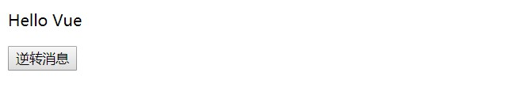

# vue 

> 作者是个华人,教程还有中文.
>> 渐进式框架

##  Vue安装配置
### 下载node.js 

## 配置node.js的环境
> vue.js是只要有个js文件就能跑的

因为vue.js是依赖于node.js框架来的
下载地址:https://nodejs.org/en/download
教程帖子 https://www.cnblogs.com/zhaomeizi/p/8483597.html

- 配置node默认缓存路径 这两个要不要都没关系的 还烦人
`npm config set cache "E:\node.js\node_cache"`

- 配置node默认全局路径
`npm config set prefix "E:\node.js\node_global"`

- 设置淘宝镜像
`npm install -g cnpm --registry=https://registry.npm.taobao.org`

- 设置环境变量

- 安装vue
`cnpm install vue -g`

- 安装vue命令行工具 脚手架
`cnpm install vue-cli -g`

**总结** vue基于node,node是一个平台,vue是这个平台上的一个组件


## 1.Vue语法
### 1.1 基本单向渲染语法
- **js渲染到dom中**
    插入到dom中,显示
    ```javascript
    <div id="t1">
     <h2>{{name}}</h2>
    </div>
    ```
    ```javascript
    var app = new Vue({
        el:"#t1",
        data:{
            name: "煞笔"
        }
    });
    ```
    - 效果图
    


- **浏览器安装vue调试插件,直接修改元素值**


- **在dom中直接绑定vue事件,并且赋值**
    ```javascript
    <div id="t1">
        <span v-bind:title="name">
            鼠标悬停可以显示name中的额值
            v-bind:title 表示当前元素绑定了一个title (鼠标悬浮事件)
        </span>
    </div>
    ```

    ```javascript
    //创建vue对象
    var app = new Vue({
        el:"#t1",
        data:{
            name: "煞笔"
        }
    });
    ```
    - 鼠标悬停,出现一个name的值
    


## 2.指令
> 指令带有**v-** 会被渲染到Dom上

### 2.1 鼠标悬停指令
`v-bind:title="悬浮信息,vue对象变量"`


### 2.2 条件指令
- if
`v-if="布尔表达式"`

- show
`v-show=布尔表达式"`
> 他们区别在于,当if为值为false时,该元素不在dom中渲染,show
为false时,所在元素的display:none
>> 所以if的效率更高
>
> 如上
### 2.3 循环指令
`v-for:`

```javascript
    <div id="t2">
    <ol>
        <li v-for="todo in todos">
            {{ todo.text }}
        </li>
    </ol>
</div>
```

```javascript
    //创建vue对象
var app = new Vue({
    el:"#t2",
    data:{
        name: "煞笔",
        todos: [
            { text: '学习 JavaScript' },
            { text: '学习 Vue' },
            { text: '整个牛项目' }
        ]
    }
});
```
- 效果图片


### 2.3 事件监听
`v-on:[方法名]` on事件一般绑定方法,方法在vue对象中的固定名称是methods
```Javascript
 <div id="t3">
        <p>{{ message }}</p>
        <button v-on:click="reverseMessage">逆转消息</button>
 </div>
```
> 这里的this,值得是当前app对象
```javascript
var app = new Vue({
        el:"#t3",
        data:{
            message:'Hello Vue'
        },
        methods:{
            reverseMessage: function () {
                this.message = this.message.split('').reverse().join('');
            }
        }
    });
```
- 效果图
    
    

### 2.4 双向绑定
```javascript
<div id="t4">
        <p>{{message}}</p>
        <input v-model="message">
    </div>
```
> 一个v-model ,实现了输入框输入啥,页面上直接显示啥,动态的,vue对象提供默认,也可以提供值
```javascript
  var app = new Vue({
        el:"#t4",
        data:{
            message:'Hello Vue'
        }
    });
```
- 效果图
    


## 3.Vue实例
- el: Dom元素Element缩写,选择器,用来标记元素
- data:数据模型,在这个里面申明vue对象的成员变量,并使用
- methods:函数,自定义的业务方法
- created(): 钩子函数,类似于java对象的构造函数,用于初始化vue对象,发送ajax请求,初始化对象数据
- watch:可以监控一个值的变化,从而做出对应反应 每变化一次,就会运行一次其中的方法

> 相对完整的Vue组件对象
```JavaScript 
    //创建vue对象
    let app = new Vue({
        el:"#t4",
        data:{
            title: "悬浮显示",
            message:'Hello Vue',
            num: 0,
            scoke: 0
        },
        created() {
            this.title = "钩子函数",
            this.message= "构造函数"
        },
        methods:{
            cli() {
                this.message = this.num++;
            }
        },
         watch:{
            scoke(newVal,oldVal){
                console.log(newVal, oldVal);
            }
        },
    });
```


- watch案例
```javascript
<div id="t5">
    <input type="button" v-on:click="add">
</div>
```

```javascript
 //创建vue对象
    let app = new Vue({
        el:"#t5",
        data:{
            scoke: 0
        },
        watch:{
            scoke(newVal,oldVal){
                console.log(newVal, oldVal);
            }
        },
        methods:{
            add() {
                this.scoke += 1;
            }
        }
    });
```

> 点击按钮,出发add时间,socke++,scoke每次改变,都会被watch捕捉到