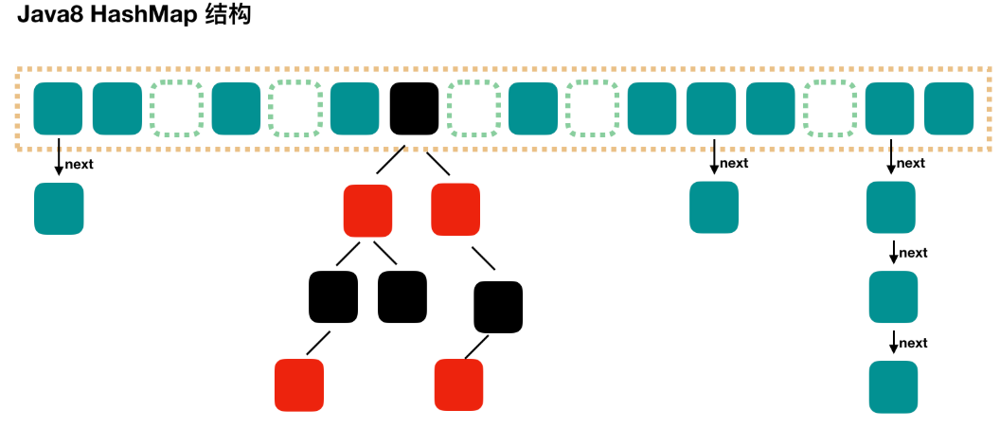

# 字段

### DEFAULT_INITIAL_CAPACITY

```java
//默认初始化时的容量
static final int DEFAULT_INITIAL_CAPACITY = 1 << 4; // aka 16
```


### MAXIMUM_CAPACITY

```java
//最大容量
static final int MAXIMUM_CAPACITY = 1 << 30;
```

### DEFAULT_LOAD_FACTOR

```JAVA
//默认负载因子 
static final float DEFAULT_LOAD_FACTOR = 0.75f;
```


### TREEIFY_THRESHOLD

```java
//默认转换树的阙值
//当hash结构被转换为红黑树时，这个树至少有8个节点
//当链表的最大长度超过8的时候，会自动转成红黑树结构
static final int TREEIFY_THRESHOLD = 8;
```


### UNTREEIFY_THRESHOLD


# 方法

### hashCode()  

> 为散列集合提供散列计算，HashMap HashSet HashTable

默认情况下（不被重写），Object对象中的hashCode返回的是对象的32位地址


### put()

注解解释：

```
将存入的值和Key和Value关联，如果当前集合中有和当前Key，则把旧的替换掉；
```

```java
public V put(K key, V value) {
    return putVal(hash(key), key, value, false, true);//这里面调用了putVal方法
}
```


### putVal()

```java
   final V putVal(
       			   int hash,  //计算的hashcode
                   K key,     
                   V value,
                   boolean onlyIfAbsent, //如果为true，那么就只有在key不存时才会继续操作
                   boolean evict
                   )
       
   {
        Node<K,V>[] tab; 
        Node<K,V> p; 
        int n, i;
       // 如果table的值为空，或者数组的长度为0，则进入并初始化值
       // 出发resize（）进行第一次初始化，第一次初始化容量为默认的16
        if ((tab = table) == null || (n = tab.length) == 0)
            n = (tab = resize()).length;
       // 找到具体的数组下标，如果此位置没有值，那么直接初始化一下 Node 并放置在这个位置就可以了
        if ((p = tab[i = (n - 1) & hash]) == null)
            tab[i] = newNode(hash, key, value, null);
        else { // 数组该位置有数据了(key的hash值重复)
            Node<K,V> e; 
            K k;
            // 首先，判断该位置的第一个数据和我们要插入的数据，key 是不是"相等"，如果是，取出这个节点
            if (p.hash == hash &&
                ((k = p.key) == key || (key != null && key.equals(k))))
                e = p;
            else if (p instanceof TreeNode)
                // 如果该节点是代表红黑树的节点，调用红黑树的插值方法
                e = ((TreeNode<K,V>)p).putTreeVal(this, tab, hash, key, value);
            else {
                  // 到这里，说明数组该位置上是一个链表
                for (int binCount = 0; ; ++binCount) {
                     // 插入到链表的最后面(Java7 是插入到链表的最前面)
                    if ((e = p.next) == null) {
                        p.next = newNode(hash, key, value, null);
                          // TREEIFY_THRESHOLD 为 8，所以，如果新插入的值是链表中的第 9 个
                        if (binCount >= TREEIFY_THRESHOLD - 1) // -1 for 1st
                              // 会触发下面的 treeifyBin，也就是将链表转换为红黑树
                            treeifyBin(tab, hash);
                        break;
                    }
                    // 如果在该链表中找到了"相等"的 key(== 或 equals)
                    if (e.hash == hash &&
                        ((k = e.key) == key || (key != null && key.equals(k))))
                         // 此时 break，那么 e 为链表中[与要插入的新值的 key "相等"]的 node
                        break;
                    p = e;
                }
            }
             // e!=null 说明存在旧值的key与要插入的key"相等"
            // 对于我们分析的put操作，下面这个 if 其实就是进行 "值覆盖"，然后返回旧值
            if (e != null) { // existing mapping for key
                V oldValue = e.value;
                if (!onlyIfAbsent || oldValue == null)
                    e.value = value;
                afterNodeAccess(e);
                return oldValue;
            }
        }
        ++modCount;
       // 如果 HashMap 由于新插入这个值导致 size 已经超过了阈值，需要进行扩容
        if (++size > threshold)
            resize();
        afterNodeInsertion(evict);
        return null;
    }
```


### get()

```java

    public V get(Object key) {
        Node<K,V> e;
        return (e = getNode(hash(key), key)) == null ? null : e.value;
    }


    final Node<K,V> getNode(int hash, Object key) {
        Node<K,V>[] tab; 
        Node<K,V> first, e; 
        int n; 
        K k;
        if ((tab = table) != null && (n = tab.length) > 0 &&
            (first = tab[(n - 1) & hash]) != null) {
            if (first.hash == hash && // always check first node
                ((k = first.key) == key || (key != null && key.equals(k))))
                return first;
            if ((e = first.next) != null) {
                if (first instanceof TreeNode)
                    return ((TreeNode<K,V>)first).getTreeNode(hash, key);
                do {
                    if (e.hash == hash &&
                        ((k = e.key) == key || (key != null && key.equals(k))))
                        return e;
                } while ((e = e.next) != null);
            }
        }
        return null;
    }
```


### resize()

```java
	//自动扩容方法
	final Node<K,V>[] resize() {
        Node<K,V>[] oldTab = table;
        int oldCap = (oldTab == null) ? 0 : oldTab.length;
        int oldThr = threshold;
        int newCap, newThr = 0;
        if (oldCap > 0) {
            if (oldCap >= MAXIMUM_CAPACITY) {
                threshold = Integer.MAX_VALUE;
                return oldTab;
            }
            else if ((newCap = oldCap << 1) < MAXIMUM_CAPACITY &&
                     oldCap >= DEFAULT_INITIAL_CAPACITY)
                newThr = oldThr << 1; // double threshold
        }
        else if (oldThr > 0) // initial capacity was placed in threshold
            newCap = oldThr;
        else {               // zero initial threshold signifies using defaults
            newCap = DEFAULT_INITIAL_CAPACITY;
            newThr = (int)(DEFAULT_LOAD_FACTOR * DEFAULT_INITIAL_CAPACITY);
        }
        if (newThr == 0) {
            float ft = (float)newCap * loadFactor;
            newThr = (newCap < MAXIMUM_CAPACITY && ft < (float)MAXIMUM_CAPACITY ?
                      (int)ft : Integer.MAX_VALUE);
        }
        threshold = newThr;
        @SuppressWarnings({"rawtypes","unchecked"})
        Node<K,V>[] newTab = (Node<K,V>[])new Node[newCap];
        table = newTab;
        if (oldTab != null) {
            for (int j = 0; j < oldCap; ++j) {
                Node<K,V> e;
                if ((e = oldTab[j]) != null) {
                    oldTab[j] = null;
                    if (e.next == null)
                        newTab[e.hash & (newCap - 1)] = e;
                    else if (e instanceof TreeNode)
                        ((TreeNode<K,V>)e).split(this, newTab, j, oldCap);
                    else { // preserve order
                        Node<K,V> loHead = null, loTail = null;
                        Node<K,V> hiHead = null, hiTail = null;
                        Node<K,V> next;
                        do {
                            next = e.next;
                            if ((e.hash & oldCap) == 0) {
                                if (loTail == null)
                                    loHead = e;
                                else
                                    loTail.next = e;
                                loTail = e;
                            }
                            else {
                                if (hiTail == null)
                                    hiHead = e;
                                else
                                    hiTail.next = e;
                                hiTail = e;
                            }
                        } while ((e = next) != null);
                        if (loTail != null) {
                            loTail.next = null;
                            newTab[j] = loHead;
                        }
                        if (hiTail != null) {
                            hiTail.next = null;
                            newTab[j + oldCap] = hiHead;
                        }
                    }
                }
            }
        }
        return newTab;
    }
```


# 内部类

## static class Node<K,V>

```java
// 这就是一个链表类，用于村放value的
static class Node<K,V> implements Map.Entry<K,V> {
        //对应key的hash值
        final int hash;
        //对应的key
        final K key;
        //value的值
        V value;
        //下一节链表
        Node<K,V> next; //当前类对象
		
        //构造
        Node(int hash, K key, V value, Node<K,V> next) {
            this.hash = hash;
            this.key = key;
            this.value = value;
            this.next = next;
        }
		//获取key
        public final K getKey()        { return key; }
        //获取value
        public final V getValue()      { return value; }
        
        public final String toString() { return key + "=" + value; }
        
        public final int hashCode() {
            return Objects.hashCode(key) ^ Objects.hashCode(value);
        }
		
        public final V setValue(V newValue) {
            V oldValue = value; // 创建一个新对象保存原来的value
            value = newValue;  // 将当前类的全局变量value替换为新值
            return oldValue;  // 返回了原来的value
        }

        public final boolean equals(Object o) {
            if (o == this)
                return true;
            if (o instanceof Map.Entry) {
                Map.Entry<?,?> e = (Map.Entry<?,?>)o;
                if (Objects.equals(key, e.getKey()) &&
                    Objects.equals(value, e.getValue()))
                    return true;
            }
            return false;
        }
    }
```


