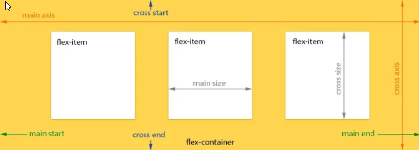
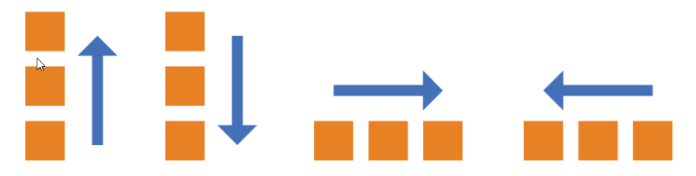
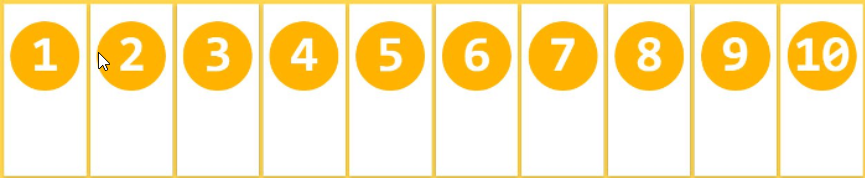
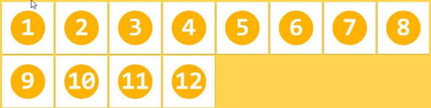
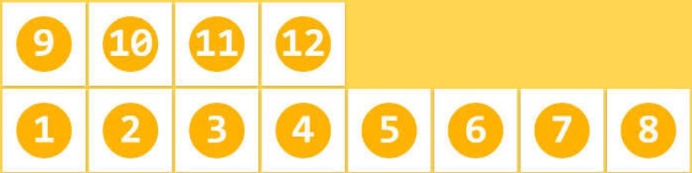

# assetswxml 和 wxss 的桥梁 -- 选择器

|                            选择器                            |         例子          |                      例子描述                       |
| :----------------------------------------------------------: | :-------------------: | :-------------------------------------------------: |
| [.*class*](http://www.w3school.com.cn/cssref/selector_class.asp) |        .intro         |           选择 class="intro" 的所有元素。           |
|  [#*id*](http://www.w3school.com.cn/cssref/selector_id.asp)  |      #firstname       |          选择 id="firstname" 的所有元素。           |
|   [*](http://www.w3school.com.cn/cssref/selector_all.asp)    |           *           |                   选择所有元素。                    |
| [*element*](http://www.w3school.com.cn/cssref/selector_element.asp) |           p           |                 选择所有 <p> 元素。                 |
| [*element*,*element*](http://www.w3school.com.cn/cssref/selector_element_comma.asp) |         div,p         |        选择所有 <div> 元素和所有 <p> 元素。         |
| [*element* *element*](http://www.w3school.com.cn/cssref/selector_element_element.asp) |         div p         |        选择 <div> 元素内部的所有 <p> 元素。         |
| [*element*>*element*](http://www.w3school.com.cn/cssref/selector_element_gt.asp) |         div>p         |      选择父元素为 <div> 元素的所有 <p> 元素。       |
| [*element*+*element*](http://www.w3school.com.cn/cssref/selector_element_plus.asp) |         div+p         |     选择紧接在 <div> 元素之后的所有 <p> 元素。      |
| [[*attribute*\]](http://www.w3school.com.cn/cssref/selector_attribute.asp) |       [target]        |           选择带有 target 属性所有元素。            |
| [[*attribute*=*value*\]](http://www.w3school.com.cn/cssref/selector_attribute_value.asp) |    [target=_blank]    |          选择 target="_blank" 的所有元素。          |
| [[*attribute*~=*value*\]](http://www.w3school.com.cn/cssref/selector_attribute_value_contain.asp) |    [title~=flower]    |    选择 title 属性包含单词 "flower" 的所有元素。    |
| [[*attribute*\|=*value*\]](http://www.w3school.com.cn/cssref/selector_attribute_value_start.asp) |      [lang\|=en]      |      选择 lang 属性值以 "en" 开头的所有元素。       |
| [:link](http://www.w3school.com.cn/cssref/selector_link.asp) |        a:link         |              选择所有未被访问的链接。               |
| [:visited](http://www.w3school.com.cn/cssref/selector_visited.asp) |       a:visited       |              选择所有已被访问的链接。               |
| [:active](http://www.w3school.com.cn/cssref/selector_active.asp) |       a:active        |                   选择活动链接。                    |
| [:hover](http://www.w3school.com.cn/cssref/selector_hover.asp) |        a:hover        |            选择鼠标指针位于其上的链接。             |
| [:focus](http://www.w3school.com.cn/cssref/selector_focus.asp) |      input:focus      |             选择获得焦点的 input 元素。             |
| [:first-letter](http://www.w3school.com.cn/cssref/selector_first-letter.asp) |    p:first-letter     |             选择每个 <p> 元素的首字母。             |
| [:first-line](http://www.w3school.com.cn/cssref/selector_first-line.asp) |     p:first-line      |              选择每个 <p> 元素的首行。              |
| [:first-child](http://www.w3school.com.cn/cssref/selector_first-child.asp) |     p:first-child     |    选择属于父元素的第一个子元素的每个 <p> 元素。    |
| [:before](http://www.w3school.com.cn/cssref/selector_before.asp) |       p:before        |         在每个 <p> 元素的内容之前插入内容。         |
| [:after](http://www.w3school.com.cn/cssref/selector_after.asp) |        p:after        |         在每个 <p> 元素的内容之后插入内容。         |
| [:lang(*language*)](http://www.w3school.com.cn/cssref/selector_lang.asp) |      p:lang(it)       | 选择带有以 "it" 开头的 lang 属性值的每个 <p> 元素。 |
| [*element1*~*element2*](http://www.w3school.com.cn/cssref/selector_gen_sibling.asp) |         p~ul          |        选择前面有 <p> 元素的每个 <ul> 元素。        |
| [[*attribute*^=*value*\]](http://www.w3school.com.cn/cssref/selector_attr_begin.asp) |    a[src^="https"]    |  选择其 src 属性值以 "https" 开头的每个 <a> 元素。  |
| [[*attribute*$=*value*\]](http://www.w3school.com.cn/cssref/selector_attr_end.asp) |    a[src$=".pdf"]     |   选择其 src 属性以 ".pdf" 结尾的所有 <a> 元素。    |
| [[*attribute**=*value*\]](http://www.w3school.com.cn/cssref/selector_attr_contain.asp) |     a[src*="abc"]     |  选择其 src 属性中包含 "abc" 子串的每个 <a> 元素。  |
| [:first-of-type](http://www.w3school.com.cn/cssref/selector_first-of-type.asp) |    p:first-of-type    |  选择属于其父元素的首个 <p> 元素的每个 <p> 元素。   |
| [:last-of-type](http://www.w3school.com.cn/cssref/selector_last-of-type.asp) |    p:last-of-type     |  选择属于其父元素的最后 <p> 元素的每个 <p> 元素。   |
| [:only-of-type](http://www.w3school.com.cn/cssref/selector_only-of-type.asp) |    p:only-of-type     |  选择属于其父元素唯一的 <p> 元素的每个 <p> 元素。   |
| [:only-child](http://www.w3school.com.cn/cssref/selector_only-child.asp) |     p:only-child      |    选择属于其父元素的唯一子元素的每个 <p> 元素。    |
| [:nth-child(*n*)](http://www.w3school.com.cn/cssref/selector_nth-child.asp) |    p:nth-child(2)     |   选择属于其父元素的第二个子元素的每个 <p> 元素。   |
| [:nth-last-child(*n*)](http://www.w3school.com.cn/cssref/selector_nth-last-child.asp) |  p:nth-last-child(2)  |          同上，从最后一个子元素开始计数。           |
| [:nth-of-type(*n*)](http://www.w3school.com.cn/cssref/selector_nth-of-type.asp) |   p:nth-of-type(2)    |  选择属于其父元素第二个 <p> 元素的每个 <p> 元素。   |
| [:nth-last-of-type(*n*)](http://www.w3school.com.cn/cssref/selector_nth-last-of-type.asp) | p:nth-last-of-type(2) |        同上，但是从最后一个子元素开始计数。         |
| [:last-child](http://www.w3school.com.cn/cssref/selector_last-child.asp) |     p:last-child      |    选择属于其父元素最后一个子元素每个 <p> 元素。    |
| [:root](http://www.w3school.com.cn/cssref/selector_root.asp) |         :root         |                 选择文档的根元素。                  |
| [:empty](http://www.w3school.com.cn/cssref/selector_empty.asp) |        p:empty        |   选择没有子元素的每个 <p> 元素（包括文本节点）。   |
| [:target](http://www.w3school.com.cn/cssref/selector_target.asp) |     #news:target      |             选择当前活动的 #news 元素。             |
| [:enabled](http://www.w3school.com.cn/cssref/selector_enabled.asp) |     input:enabled     |            选择每个启用的 <input> 元素。            |
| [:disabled](http://www.w3school.com.cn/cssref/selector_disabled.asp) |    input:disabled     |             选择每个禁用的 <input> 元素             |
| [:checked](http://www.w3school.com.cn/cssref/selector_checked.asp) |     input:checked     |           选择每个被选中的 <input> 元素。           |
| [:not(*selector*)](http://www.w3school.com.cn/cssref/selector_not.asp) |        :not(p)        |             选择非 <p> 元素的每个元素。             |
| [::selection](http://www.w3school.com.cn/cssref/selector_selection.asp) |      ::selection      |             选择被用户选取的元素部分。              |


 # 布局flexBox

```
height:100vh; 将屏幕分为100份,这里高度占用100个
```

## 一.Flex布局是什么?

Flex是Flexible Box 的缩写,意思为"弹性布局",用来为盒状模型提供最大灵活性.

任何一个容器都可以指定为Flex布局

```javascript
.box{
    display:flex;
}
```

行内元素也可以使用Flex布局

```javascript
.box{
    display:inline-flex;
}
```

Webkit内核的浏览器必须加上 -webkit前缀

```javascript
.box{
    display:-webkit-flex;
    display:flex;
}

```

## 二.基本概念

采用Flex布局,称为Flex容器,简称容器.它的所有子元素成为容器成员,成为Flex项目(flexitem);

	

- 主轴(main axis) : 和边框交叉的线,默认主轴是水平的;
  - 主轴两端分别是 main start 和 main end ,线开始的方向为main start
- 交叉轴(cross axis) : 垂直于主轴的线;
  - 交叉轴开始的位置是cross start,结束的位置是cross end;
- 单个项目占据的主轴距离是 main size 
- 单个项目占据的交叉轴距离 cross size 


## 三.容器的属性

flex中容器的属性

>- flex-direction : 配置主轴和交叉轴的方向
>- flex-wrap : 
>- flex-flow
>- justify-content
>- align-items
>- align-content

### 3.1 flex-direction 

决定主轴的方向(即项目的排列顺序)

```javascript
.box{
    flex-direction:row | row-reverse | column | column-reverse
}
```

- `row`（默认值）：主轴为水平方向，起点在左端。
- `row-reverse`：主轴为水平方向，起点在右端。
- `column`：主轴为垂直方向，起点在上沿。
- `column-reverse`：主轴为垂直方向，起点在下沿。




### 3.2 flex-wrap

默认情况下,项目都排在一条轴线上.flex-wrap属性定义,如果一条线上排不上,则可以使用该属性进行换行;

```javascript
.box{
    flex-wrap:nowrap | warp | warp-reverse
}
```

- `nowrap `默认不换行
- `warp `换行 第一行在上面
- `warp-reverse `第一行在下面 换行

nowrap



warp



warp-reverse




### 3.3 flex-flox 

`flex-flow`属性是`flex-direction`属性和`flex-wrap`属性的简写形式，默认值为`row nowrap`。

```javascript
.box {
  flex-flow: <flex-direction> || <flex-wrap>;
}
```


### 3.4 justify-content

`justify-content`属性定义了项目在主轴上的**对齐方式**。

```javascript
.box {
  justify-content: flex-start | flex-end | center | space-between | space-around;
}
```

- `flex-start`（默认值）：左对齐
- `flex-end`：右对齐
- `center`： 居中
- `space-between`：两端对齐，项目之间的间隔都相等。
- `space-around`：每个项目两侧的间隔相等。所以，项目之间的间隔比项目与边框的间隔大一倍。


### 3.5 align-items 

`align-items`定义容器在交叉轴上的对齐方式

```javascript
.box {
  align-items: flex-start | flex-end | center | baseline | stretch;
}
```

- `flex-start`：交叉轴的起点对齐。
- `flex-end`：交叉轴的终点对齐。
- `center`：交叉轴的中点对齐。
- `baseline`: 项目的第一行文字的基线对齐。
- `stretch`（默认值）：如果项目未设置高度或设为auto，将占满整个容器的高度。


### 3.6 align-content

`align-content`属性定义了多根**交叉**轴线的对齐方式。如果项目只有一根轴线，该属性不起作用。	

- `flex-start` : 与交叉轴七点对其;
- `flex-end`：与交叉轴的终点对齐。
- `center`：与交叉轴的中点对齐。
- `space-between`：与交叉轴两端对齐，轴线之间的间隔平均分布。
- `pace-around`：每根轴线两侧的间隔都相等。所以，轴线之间的间隔比轴线与边框的间隔大一倍。
- `stretch`（默认值）：轴线占满整个交叉轴。


## 四.项目的属性

### 4.1 Order

- `order`
- `flex-grow`
- `flex-shrink`
- `flex-basis`
- `flex`
- `align-self`

`order`属性定义项目的排列顺序。数值越小，排列越靠前，默认为0。

```javascript
.item {
  order: <integer>;
}
```


### 4.2 flex-grow 

`flex-grow`属性定义项目的放大比例，默认为`0`，即如果存在剩余空间，也不放大。

```
.item {
  flex-grow: <number>; /* default 0 */
}
```


如果所有项目的`flex-grow`属性都为1，则它们将等分剩余空间（如果有的话）。如果一个项目的`flex-grow`属性为2，其他项目都为1，则前者占据的剩余空间将比其他项多一倍。


### 4.3 flex-shrink属性

`flex-shrink`属性定义了项目的缩小比例，默认为1，即如果空间不足，该项目将缩小。

```
.item {
  flex-shrink: <number>; /* default 1 */
}
```


如果所有项目的`flex-shrink`属性都为1，当空间不足时，都将等比例缩小。如果一个项目的`flex-shrink`属性为0，其他项目都为1，则空间不足时，前者不缩小。

负值对该属性无效。

### 4.4 flex-basis 

`flex-basis`属性定义了在分配多余空间之前，项目占据的主轴空间（main size）。浏览器根据这个属性，计算主轴是否有多余空间。它的默认值为`auto`，即项目的本来大小。

```
.item {
  flex-basis: <length> | auto; /* default auto */
}
```

它可以设为跟`width`或`height`属性一样的值（比如350px），则项目将占据固定空间。

### 4.5 flex属性

`flex`属性是`flex-grow`, `flex-shrink` 和 `flex-basis`的简写，默认值为`0 1 auto`。后两个属性可选。

```javascript
.item {
  flex: none | [ <'flex-grow'> <'flex-shrink'>? || <'flex-basis'> ]
}
```

该属性有两个快捷值：`auto` (`1 1 auto`) 和 none (`0 0 auto`)。

建议优先使用这个属性，而不是单独写三个分离的属性，因为浏览器会推算相关值。


### 4.6 align-self 属性

`align-self`属性允许单个项目有与其他项目不一样的对齐方式，可覆盖`align-items`属性。默认值为`auto`，表示继承父元素的`align-items`属性，如果没有父元素，则等同于`stretch`。

```javascript
.item {
  align-self: auto | flex-start | flex-end | center | baseline | stretch;
}
```