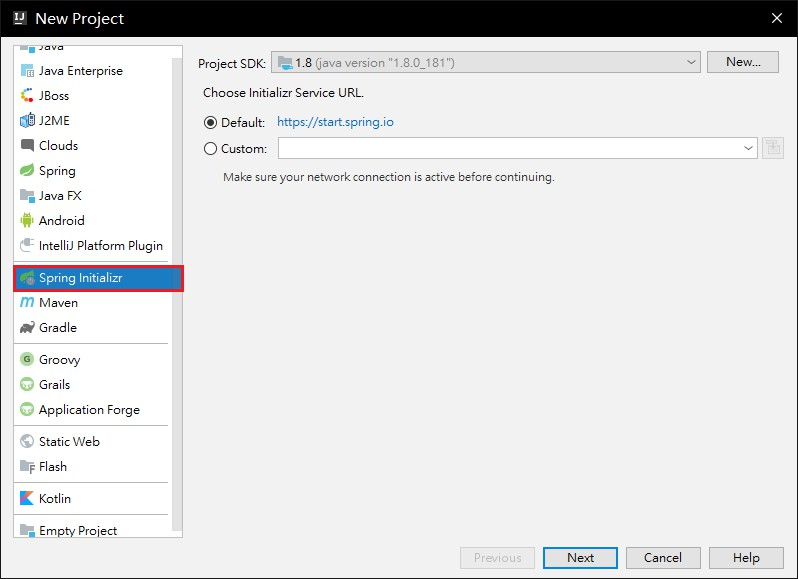
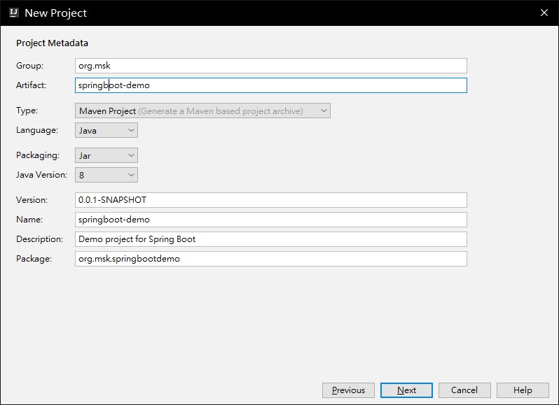
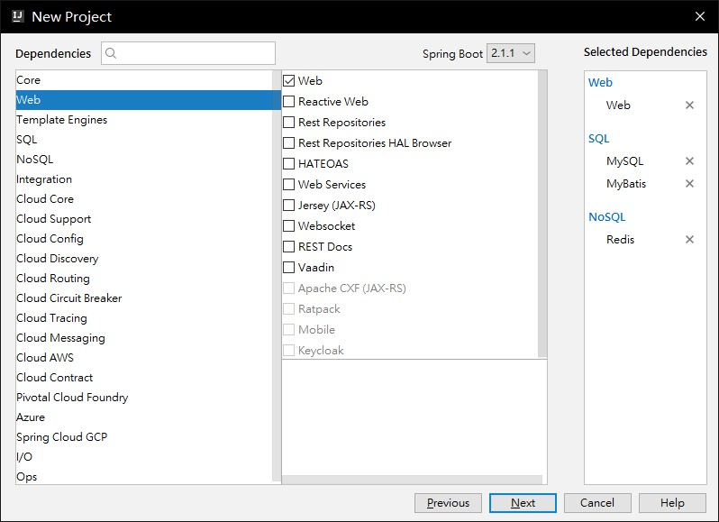
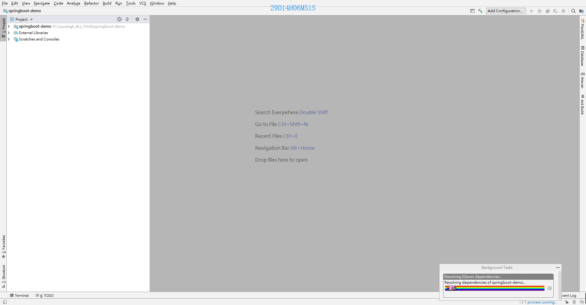
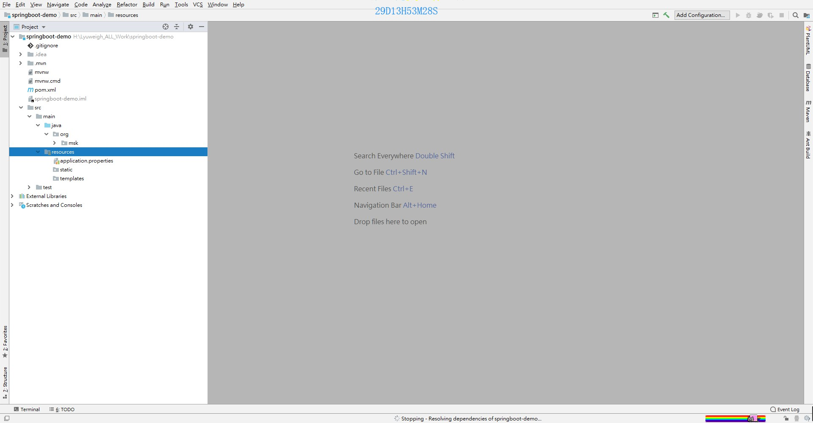

# SpringBoot 入门


| 注解名                 | 作用                                                      | 配置级别 |
| ---------------------- | --------------------------------------------------------- | -------- |
| @EnableAutoConfiguration： | 启用自动配置                                              | class    |
| @ComponentScan         | 开启注解扫描                                              | class    |
| @SpringBootApplication： | 启动自动配置并且开启自动注解扫描,相当于以上两个注解一起用 | class    |
| @SpringBootConfiguration：|相当于Configuraiton注解，声明一个类是一个java配置类，通常一个工程中只包含一个该注解                                                    |          |


**@SpringBootApplication :** 标注在一个类上,说明这个类是SpringBoot的主配置类,SpringBoot

就应该运行这个类的main方法来启动Spring应用 **它唯一**

```java
@Target(ElementType.TYPE)
@Retention(RetentionPolicy.RUNTIME)
@Documented
@Inherited
@SpringBootConfiguration
@EnableAutoConfiguration
@ComponentScan(excludeFilters = {
        @Filter(type = FilterType.CUSTOM, classes = TypeExcludeFilter.class),
        @Filter(type = FilterType.CUSTOM, classes = AutoConfigurationExcludeFilter.class) })
public @interface SpringBootApplication {
 
```

 

- @SpringBootConfiguration : 标注在某个类上,表示该类是SpringBoot的某个配置类

- @Configuration: 用来标注一个类,表名这个类是Spring容器的配置类----相当于配置文件,配置类也是配置容器中的一个组件

- @EnableAutoConfiguration: 开启自动配置功能

```java
@AutoConfigurationPackage
@Import(AutoConfigurationImportSelector.class)
public @interface EnableAutoConfiguration {
```

- @AutoConfigurationPackage: 自动配置包
  - @Import(AutoConfigurationPackages.Registrar.class): Spring的底层注解,给容器导入一个类
  - AutoConfigurationPackages.Registrar.class: 这个类,会将主配置类,也就是**@SpringBootApplication** 标注的类,所在的包及所有子包中的组件扫描到Spring容器中
- @Import(AutoConfigurationImportSelector.class)
  - AutoConfigurationImportSelector.class 将所有需要导入的组件以全类名的方式返回;这些组件就会添加到Spring容器中
    - 这个类会自动给Spring容器到导入和很多的自动配置类(xxxAutoConfiguration:就是给容器中导入这个场景所需要的所有组件,并且配置好)
    - 
    - 该配置文件所对应的**整合包**如下
     - 
  SpringBoot在启动的时候回自动从Jar包中的META-INF/spring.factories的配置文件中获取AutoConfigurationImportSelector指定的值,并且将这些值导入到容器中,自动配置类就生效了

以前需要我们手动配置的东西,现在自动配置类都会帮我们直接配置

---

 

##SpringBoot 描述:

> SpringBoot 从Spring4.0 开始
>
> 对Spring整个技术栈进行整合

 

#### 优点:

1. 快速搭建项目
2. 嵌入式Servlet容器,无需打包
3. 自动的版本控制
4. Starters自动配置,简化开发,也可以修改默认配置
5. 无需配置XML,无代码生成
6. 提供生产环境的监控
7. 于云计算天然集成


##  微服务介绍

微服务:是一种架构风格

一个应用, 应该是一组小型服务,每个不同的服务之间通过**HTTP**的方式进行沟通

**每一个服务都应该是可替换的,可独立的,可升级的 独立单元**

 

# Springboot问题

## 1. 什么是SpringBoot?

Springboot是Spring开源组织下的子项目,目的在于简化Spring开发难度,基于Spring4.x;

## 2. 为什么要使用SpringBoot?

- 独立运行

  springboot中内嵌了Tomcat,默认就支持Servlet,不需要再打成war包放到容器里面,方便项目可以直接在jvm中运行了,所以SpringBoot项目只需要打成一个Jar包就可以运行了;

- 简化配置

  spring-boot-web-start 中引入了tomcat/jboss的依赖,并且引入hibernate-validator,这个jar包的作用是对实体类进行注解约束

- 自动配置

  根据注解和注解扫描自动,或者对象配置的方式自动将所需要的对象配置成bean注入到spring容器中

  只要引入支持springboot的jar包,也能自动配置,比如个各种启动器;

- 应用监控

  方便运维,比如Actuator,做健康监测

- 没有代码生成和XML配置

## 3.SpringBoot的核心配置文件有几个? 作用是什么?

application和bootstrap

application主要用于springboot的自动配置

bootstrap适用于spring cloud config ,用于配置一些项目中一定要存在的对象,比如加密解密sql文件,一些不能被修改覆盖爱的属性

## 4. SpringBoot配置文件有哪几种格式?

properties 和 yml 两种 书写方式不同,yml格式不支持@PropertySource注解,该注解原理是解析map形式的配置文件,Key-value,所以不支持层次鲜明的yml

## 5. Spring的核心注解是哪几个? 又是由哪些注解组成的?

- @SpringBootApplication : 作用在起动器上

  - @EnableAutoConfiguration 开启SpringBoot自带的配置,也可以关闭一些自动配置是选项

    如: `@SpringBootApplication(exclude = { DataSourceAutoConfiguration.class })`

  - @CommonScan包扫描

  - @SpringBootConfiguration,说明当前类是一个配置类

## 6. 创建一个SpringBoot项目的方式有哪些?

- 继承spring-boot-starter-parent项目
- 引入spring-boot-dependenicies依赖

## 7. SpringBoot的运行方式

- 打包命令,放到tomcat等容器中运行
- 直接运行jar,使用maven插件
- 直接执行main方法

## 8. SpringBoot自动配置的原理是什么?

@EnableAutpConfiguration注解,引入了一个配置类,主要是加载一个spring.factories配置文件,里面配置了很多自动加载的bean对象

## 9.对Starts启动器的理解

集成了一大堆的依赖包

## 10. 如何在SpringBoot启动的时候运行一些特定的代码?

实现接口 ApplicationRunner 和 CommandLineRunner,可以在服务启动的时候执行一些代码,比如查看项目参数如何

## 11. SpringBoot读取配置文件的方式

@PropertySource @Value @Environment @ConfigurationProperties


## 12. SpringBoot支持哪些日志框架,默认支持的是什么?

默认Lockback, 也支持log4j,util logging

## 13. 如何支持热部署?

引入devtools依赖,修改一个java类时会进行热更新,也可以使用idea插件

## 14. SpringBoot 的配置文件加载顺序是什么?

1. 开发者工具DevTools

2. 单元测试上的@TestPropertySource

3. 单元测试上的@SpringBootTest注解

4. java jar xxxx.jar 命令

5. JNDL

6. Java系统参数

7. .properties

8. yml

   ​


# 一. SpringBoot简单使用

 

## 1. SpringBoot 编写 HelloWord

### 1.1 创建一个Maven工程,导入依SpringBoot赖

```
<parent>
    <groupId>org.springframework.boot</groupId>
    <artifactId>spring-boot-starter-parent</artifactId>
    <version>2.0.2.RELEASE</version>
</parent>
 
<dependencies>
    <dependency>
        <groupId>org.springframework.boot</groupId>
        <artifactId>spring-boot-starter-web</artifactId>
    </dependency>
</dependencies>
```

### 1.2 编写一个主程序

```java
/**
* @SpringBootApplication 来标注一个Spring主程序类 说明这是一个Springboot应用
*/
@SpringBootApplication
public class TestApplication {
    public static void main(String[] args) {
        SpringApplication.run(TestApplication.class, args);
    }
}
```

### 1.3 编写业务代码

```java
@Controller
public class Hello2Controller {
 
    @RequestMapping("h")
    @ResponseBody
    public String test() {
        return "hello Spring boot2";
    }
}
```

> 业务代码,可以使用SpringMvc的原始注解,也可以使用SpringBoot提供的注解,
>
> SpringBoot的注解对原始MVC注解做了简化 但是他们功能相同

### 1.4 部署SpringBoot项目

1. 打jar包

```xml
<!--这个插件可以将应用打成一个可执行的jar包-->
    <build>
        <plugins>
            <plugin>
                <groupId>org.springframework.boot</groupId>
                <artifactId>spring-boot-maven-plugin</artifactId>
            </plugin>
        </plugins>
    </build>
```

2. 通过命令 java -jar xxxxx.jar 启动项目

   访问浏览器即可

### 1.5 引入父项目

> 版本仲裁包 spring-boot-dependencies

```xml
这个项目是所有starter的父项目,对其他的starter做依赖管理  
<parent>
    <groupId>org.springframework.boot</groupId>
    <artifactId>spring-boot-starter-parent</artifactId>
    <version>2.0.2.RELEASE</version>
</parent>
 
spring-boot-starter-parent项目所依赖的父项目,还依赖另外一个项目
<parent>
    <groupId>org.springframework.boot</groupId>
    <artifactId>spring-boot-dependencies</artifactId>
    <version>2.0.2.RELEASE</version>
    <relativePath>../../spring-boot-dependencies</relativePath>
</parent>
 
 
spring-boot-dependencies
该项目中定义了对jar包版本控制的管理
他才是来真正管理SpringBoot所有的依赖版本的东西
```

 

### 1.6 导入的依赖

```xml
        <dependency>
            <groupId>org.springframework.boot</groupId>
            <artifactId>spring-boot-starter-web</artifactId>
        </dependency>
```

1. spring-boot-starter-web: SpringBoot场景启动器;

   - 帮我们导入了 web项目所需要的所有必须包,并且依赖的版本都收到**仲裁器**控制

2. SpringBoot 将所有需要的包,都抽取成一个个spring-boot-starter-* , 如果有需要就进行引入


## 2. 快速创建一个SpringBoot项目

### 2.1.选择创建Spring initalizr工程,所有的ide工具都支持



### 2.2填写坐标名,**项目名不支持大写**


### 2.3选择构建项目想要加入的功能


###2.4然后下一步下一步,项目ide回去官网自动下载项目配置


### 2.5导入成功后的项目全貌


>  这样整个架子就直接搭建好了,我们只需要写自己的逻辑就可以了

### 2.6 resource文件夹中的目录结构

- static : 保存所有的静态资源; js css images
- templates : 保存所有的模板页面;(Spring boot默认jar包使用嵌入式的Tomcat,默认不支持JSP页面);可以使用模板引擎(freenaker,thymeleaf);
- appliocation.properties: Spring 应用的配置文件;


# 二.SpringBoot配置

## 1. SpringBoot的全局配置文件

> 配置文件名称固定

- application.properties
- application.yml

> 支持两种类型的配置文件,他们作用相同

配置文件的作用: 修改SpringBoot配置的默认值,对其默认配置进行覆盖

 

### 1.1 两种配置文件的区别

application.properties

```properties
server.port=80
```

 

application.yml

```yaml
server:
  port: 81
```

:sweat_smile::但是吧,两个配置文件一起使用,优先读取的是**application.properties**

 

### 1.2 获取配置文件信息

- YAML配置文件

```yaml
persion:
    name: 张三
    age: 18
    fav:
      - arr1
      - arr2
      - arr3
    maps: {say: love,do: fuck}
    birth: 1921/1/1
```

 

- properties配置文件

```properties
persion.name=李四
persion.age=19
persion.birth=2018/1/1
persion.fav=arr1,arr2
persion.maps.say=love
persion.maps.do=fuck
```

 

- 注解@ConfigurationProperties(prefix = "persion")
  - 这个配置文件注解,只有加到一个Bean中才会有效 所有加上一个@Component注解

```java
@Component
@ConfigurationProperties(prefix = "persion")
public class Persion {
    private String name;
    private int age;
    private String[] fav;
    private Map maps;
    private Date birth;
    /**get...set...**/
}
 
```

 

- 导入配置文件处理器,绑定配置文件就会有提示
  - 前提是在类中使用@ConfigurationProperties注解绑定了,然后在配置文件中就会有自动提示

```xml
<dependency>    
    <groupId>org.springframework.boot</groupId>
    <artifactId>spring-boot-configuration-processor</artifactId>
    <optional>true</optional>
</dependency>
```

- 不适用配置文件引入注解使用@Value

```java
public class Persion {
    @Value("${persion.name}")
    private String name;
 
    @Value("#{100*2}")
    private int age;
 
    @Value("1,2,3")
    private String[] fav;
 
    private Map maps;
    private Date birth;
 
```

**@ConfigurationProperties和@Value的区别**

|              | @ConfigurationProperties | @Value     |
| ------------ | ------------------------ | ---------- |
| 功能         | 批量注入                 | 一个个指定 |
| 松散语法     | 支持                     | 不支持     |
| SPEL         | 不支持                   | 支持       |
| JSR303校验   | 支持                     | 不支持     |
| 复杂类型封装 | 支持                     | 不支持     |

- **JSR303校验**

> ```xml
> @NotNull(message="名字不能为空")
> @Max(value=120,message="年龄最大不能查过120")
> @Email(message="邮箱格式错误")
> ==============================================================
> 空检查 
> @Null 验证对象是否为null 
> @NotNull 验证对象是否不为null, 无法查检长度为0的字符串 
> @NotBlank 检查约束字符串是不是Null还有被Trim的长度是否大于0,只对字符串,且会去掉前后空格. 
> @NotEmpty 检查约束元素是否为NULL或者是EMPTY.
>
> Booelan检查 
> @AssertTrue 验证 Boolean 对象是否为 true 
> @AssertFalse 验证 Boolean 对象是否为 false
>
> 长度检查 
> @Size(min=, max=) 验证对象（Array,Collection,Map,String）长度是否在给定的范围之内 
> @Length(min=, max=) Validates that the annotated string is between min and max included.
>
> 日期检查 
> @Past 验证 Date 和 Calendar 对象是否在当前时间之前，验证成立的话被注释的元素一定是一个过去的日期 
> @Future 验证 Date 和 Calendar 对象是否在当前时间之后 ，验证成立的话被注释的元素一定是一个将来的日期 
> @Pattern 验证 String 对象是否符合正则表达式的规则，被注释的元素符合制定的正则表达式，regexp:正则表达式 flags: 指定 Pattern.Flag 的数组，表示正则表达式的相关选项。
>
> 数值检查 
> 建议使用在Stirng,Integer类型，不建议使用在int类型上，因为表单值为“”时无法转换为int，但可以转换为Stirng为”“,Integer为null 
> @Min 验证 Number 和 String 对象是否大等于指定的值 
> @Max 验证 Number 和 String 对象是否小等于指定的值 
> @DecimalMax 被标注的值必须不大于约束中指定的最大值. 这个约束的参数是一个通过BigDecimal定义的最大值的字符串表示.小数存在精度 
> @DecimalMin 被标注的值必须不小于约束中指定的最小值. 这个约束的参数是一个通过BigDecimal定义的最小值的字符串表示.小数存在精度 
> @Digits 验证 Number 和 String 的构成是否合法 
> @Digits(integer=,fraction=) 验证字符串是否是符合指定格式的数字，interger指定整数精度，fraction指定小数精度。 
> @Range(min=, max=) 被指定的元素必须在合适的范围内 
> @Range(min=10000,max=50000,message=”range.bean.wage”) 
> @Valid 递归的对关联对象进行校验, 如果关联对象是个集合或者数组,那么对其中的元素进行递归校验,如果是一个map,则对其中的值部分进行校验.(是否进行递归验证) 
> @CreditCardNumber信用卡验证 
> @Email 验证是否是邮件地址，如果为null,不进行验证，算通过验证。 
> @ScriptAssert(lang= ,script=, alias=) 
> @URL(protocol=,host=, port=,regexp=, flags=)
>
> ```

 

## 2. 引入局部(外部)配置文件

> @ConfigurationProperties 注解默认的读取路径是application.properties/yml

### 2.1使用**@PropertySource**配置指定的数据配置文件

```java
@Component
//指定了配置文件,还需要指定配置文件中的前缀,没有的话可以省略
@ConfigurationProperties(prefix = "persion")
@PropertySource("classpath:name.properties")
public class Persion {
```

### 2.2 使用@ImportResource 导入Spring.xml配置文件

- Spring的配置文件beans.xml

```xml
<?xml version="1.0" encoding="UTF-8"?>
<beans xmlns="http://www.springframework.org/schema/beans"
       xmlns:xsi="http://www.w3.org/2001/XMLSchema-instance"
       xsi:schemaLocation="http://www.springframework.org/schema/beans http://www.springframework.org/schema/beans/spring-beans.xsd">
 
    <bean class="org.msk.springboot01.Persion" id="persion"/>
</beans>
```

- 在主配置类中引入该文件

```java
@SpringBootApplication
@ImportResource(locations = "classpath:beans.xml")
public class SpringBoot01Application {
    public static void main(String[] args) {
        SpringApplication.run(SpringBoot01Application.class, args);
    }
}
```

- 测试该bean persion是否存在

```java
     @Autowired
    ApplicationContext ioc;
 
    @Test
    public void isSave() {
        boolean persion = ioc.containsBean("persion");
        System.out.println("persion = " + persion);
    }
 
 
outPut: persion = true
```

## 3. 编写配置类和引入

### 3.1 @Configuration 表名该类是一个配置类

```java
@Configuration
public class MyAppconfig {
}
```

### 3.2 @Bean 给Spring配置一个Bean

> 这个Bean在spring中的名字就是方法名

```java
@Configuration
public class MyAppconfig {
    @Bean
    public Persion persion() {
        return new Persion();
    }
}
 
```

 

 

## 4. 配置文件中使用占位符

```properties
#server.port=80
persion.name=李四${random.uuid}
persion.age=19
persion.birth=2018/1/1
persion.fav=arr1,arr2
persion.maps.say=love
persion.maps.do=fuck
```

```java
outPut: Persion{name='李四f388a722-96ba-48fd-9fef-7c4618e28a93', age=19...}
```

### 4.1 随机数

```xml
${random.value},${random.int},${random.long},${random.int(10)},${random.int[1024,4123]}
```

- 如果使用占位符导入的对象没有值,可以使用`:` 冒号配置默认值

## 5拦截器
### 5.1 实现HandlerIntecptor接口

- 实现该接口,在SpringMvc中定义一个拦截器,重写方法
    - preHandle:前置方法 如果前置方法返回false,则拦截该方法,反之放行
    - postHandle:后置方法
    - afterCompletion:完成方法


### 5.2 写一个配置类,将拦截器注册到Spring容器中
```java
@Configuration
public class MvcWebConfiguration implements WebMvcConfigurer {
    
    @Autowired
    private Myinterceptor myinterceptor;
    @Override
    public void addInterceptors(InterceptorRegistry registry) {
        registry.addInterceptor(myinterceptor).addPathPatterns("/**");
    }
}
```
- 需要实现WebmvcConfigurer接口
- 注册拦截器
- 并且添加过滤条件 