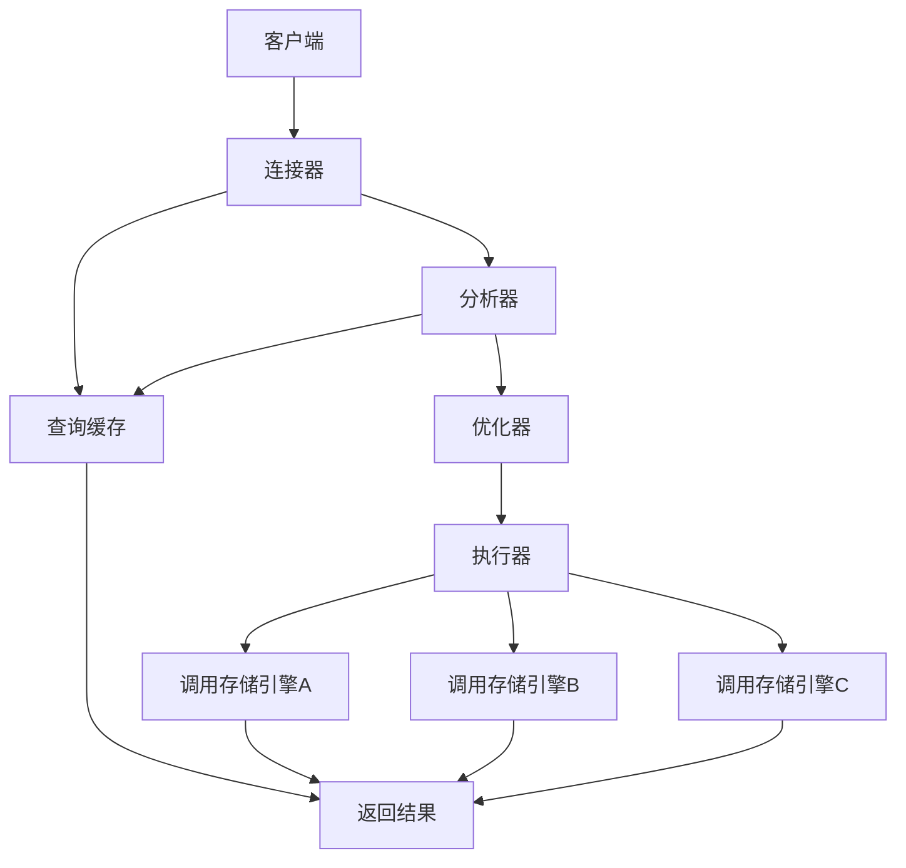
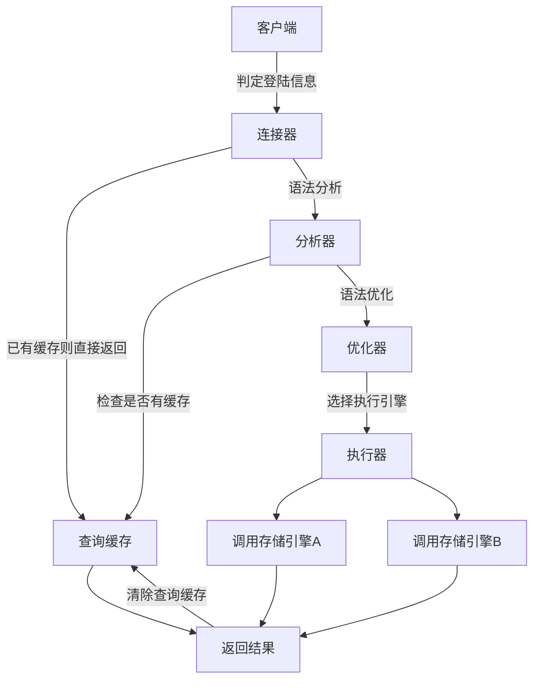
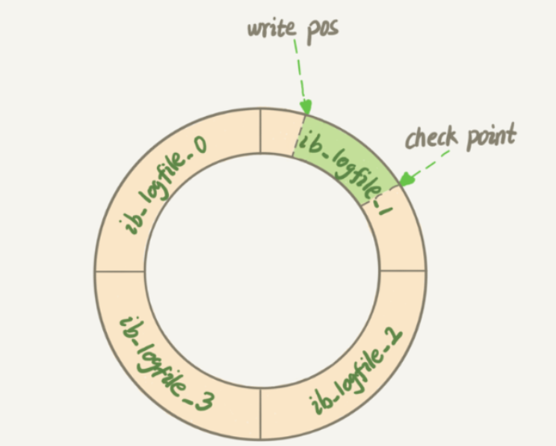
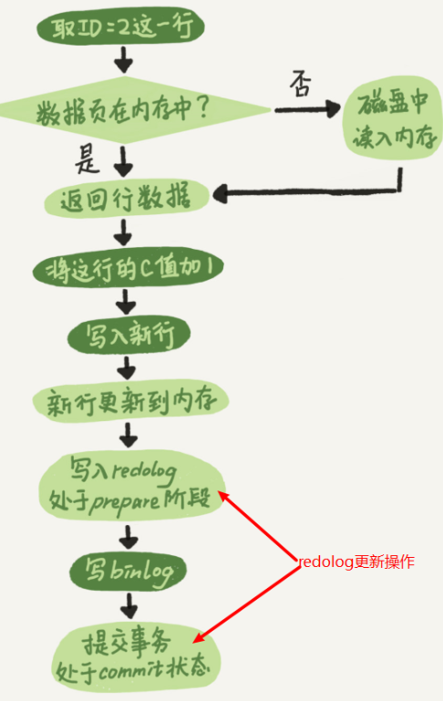
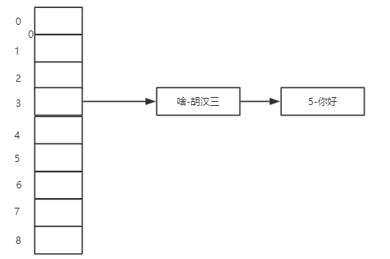
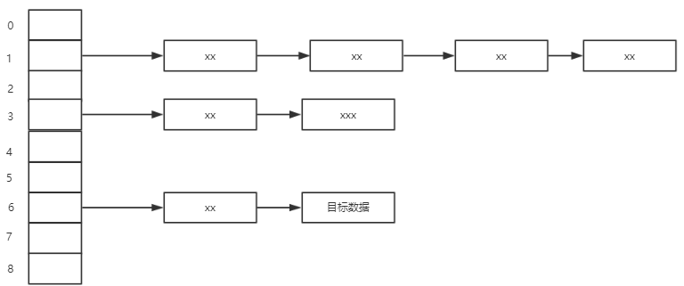
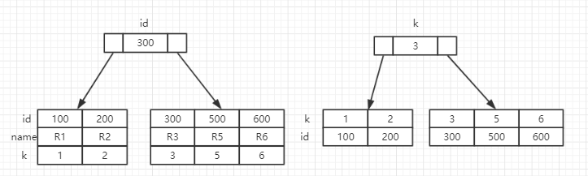
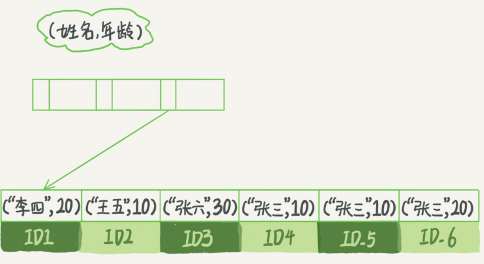
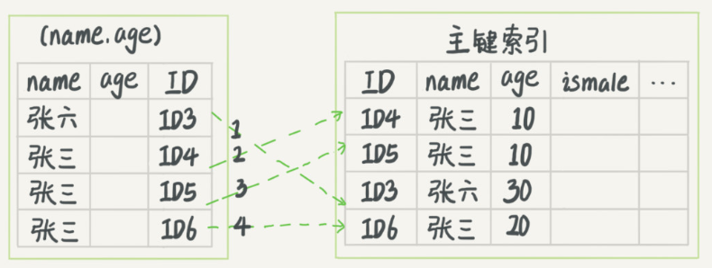
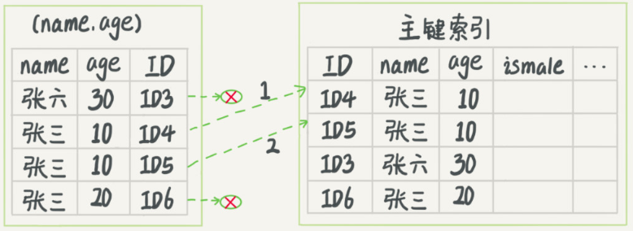

# 一. 查询语句的执行流程

```sql
select * from table
```




**总体来说，Mysql可以分为server层和存储引擎层两个部分**

- Server层包括
  - 连接器： 管理连接

  - 分析器： 词法分析，语法分析

  - 优化器： 优化SQL语法

  - 执行器： 操作引擎，返回SQL结果

  - 查询缓存： 命中缓存，直接返回结果，8.0版本Mysql取消了查询缓存

    - query_cache_type = DEMAND 禁用查询缓存

    - ```sql
      select SQL_CACHE * from T 
      -- 指定该条语句写入查询缓存
      ```

      

> 所有跨存储引擎的操作都在这一层是实现，如**存储过程，触发器，试图**等

- 存储引擎层负责：

  - 数据的存储和提取，其架构是插件式的 如：InnoDB,MyISAM,Memory等多个存储引擎
  - 可以在创建表的时候create table 语法后面加上engine=memory来指定sql引擎

  

# 二. 更新语句执行流程

**查询语句的执行流程更新语句同样会走一遍**



## 2.1 redoLog日志[InnoDB独有]

Innode的Redolog采用WAL技术，就是先将跟新信息写道日志上，有空了在进行磁盘持久化操作

> 将更新的操作日志记录下来



采用环式记录，空间大小固定，分为4个区域，若记录内存满，将一块区域的update信息执行，进行持久化操作，保证数据不丢失；

## 2.2 binLog日志[server模块]

### 2.2.1redoLog 和 binLog 的不同点

- bingLog 记录了系统所有的操作；而redoLog只记录跟新操作

- redo log 是 InnoDB 引擎特有的；binlog 是 MySQL 的 Server 层实现的，所有引擎都可以使用。
- redo log 是物理日志，记录的是“在某个数据页上做了什么修改”；binlog 是逻辑日志，记录的是这个语句的原始逻辑，比如“给 ID=2 这一行的 c 字段加 1 ”。
- redo log 是循环写的，空间固定会用完；binlog 是可以追加写入的。“追加写”是指 binlog 文件写到一定大小后会切换到下一个，并不会覆盖以前的日志。


### 2.2.2 bingLog 和 redoLog之间的关系




> 这里将写 **redolog** 分为了两个部分 prepare/commit ，这就是**两段式提交**

为了保证redoLog 和 binLog 在数据上跟新保持同步


# 三. 事务

事务问题： **脏读**，**不可重复读**，**幻读**

- 脏读： 读到了不应该存在的数据，事务A跟新了数据，还未提交，事务B就读取到了；
- 不可重复读： 没法重复读到相同的数据，事务A中多次一行数据，但未提交，事务B读取到了事务A修改后的数据；
- 幻读：一个事务有两条相同的查询，后一条查询到了前一条没查到的东西，就是幻读；

> ​    幻读是指当事务不是独立执行时发生的一种现象，例如第一个事务对一个表中的数据进行了修改，比如这种修改涉及到表中的“全部数据行”。同时，第二个事务也修改这个表中的数据，这种修改是向表中插入“一行新数据”。那么，以后就会发生操作第一个事务的用户发现表中还存在没有修改的数据行，就好象发生了幻觉一样.


**隔离级别**：

- 读未提交：一个事务还为提交，它做的变更就能被其他事务发现；
- 读提交： 一个事务提交后，它的变更才能被其他事务发现；
- 可重复读：一个事务中能看到的数据，总是和事务开始时所能看到的事务是一致的；
- 串行化： 给一行数据加锁，读锁，写锁，如果有其他线程要读写当前行，则必须要排队；


# 四. 索引

Mysql的InnoDB缓存中，索引都是B+树的形式存在的

## 4.1 HashMap数据结构

hash是一种以键-值存储数据的结构，只要输入带查找的KEY，就可以**定位**其相应的值



> 如果Key的值经过hash计算后重复，那么重复key所表示的值添加到**原有链表前面**，如图胡汉三所示


- key 只能定位到位置，具体信息还是存在链表中

- HashMap的好处就是添加和查询速度都不弱


### 4.1.2 HashMap的缺点



如果要查询1~6的目标数据，则要进行循环遍历所有的链表，消耗资源

## 4.2 主键索引和普通索引

```sql
mysql> create table T(
		id int primary key, 
		k int not null, 
		name varchar(16),
		index (k)
	)engine=InnoDB;
	
	-- 创建了两个索引，分别是主键索引和普通索引

```

### 4.2.1 它两之间的区别

1. 主键索引存储其本身及其所在行的信息，本身所在的行存在右边顺位第一个

2. 普通索引只存储主键索引的字段



当查询一段普通索引（按照普通索引来）时，通过查到的主键去主键树找行数据，然后再回来的过程，叫做回表操作；

> 基于普通非主键索引的查询会多扫描一次主键索引树，因此，应该尽量使用主键作为查询条件；


## 4.3  页分裂

> 如果，一个根索引（基于B+Tree）的左边加入了一个符合规则的值，但是此时左边的数据空间已经存满了，那么他就只能去顶替原先根节点的位置，这个操作就叫做**页分裂**

按照上面的介绍，那么原来的根节点就只能被挤到了右边，有个问题技术：那么如果右边也满了呢？ 

- 页分裂会导致性能下降；

- 有页分裂就有**页合并**，他是页分裂的逆操作，再删除数据的时候发生，同样导致性能下降；

<hr>

**如何避免页分裂，页合并问题**？

使用主键自增，每一次添加，删除操作都之会在原本索引树下面加入；


# 4.4 联合索引

创建语法：

```sql
index (a,b,c)
```

- 联合索引满足最左前缀原则（查询时如果先查a,那么速度会快很多）
- 联合索引可以使用索引下推（如果当前版本支持的化）


- 当有a,b,c 三个字段是，使用如下语句时，都会使用到联合索引；	

  ```sql
  where a = xx and b =xx and c= xx ;
  where a= xx and c = xx;
  where a = xx and b =xx ;
  where a like 'xx%';
  ```

- 如果使用or的条件，则不会使用到该索引

- 如果先决条件是b,c 不符合最左前缀原则，该索引也无效

### 4.4.1 最左前缀

如下图，当查询条件为*where name like "张%"* 时，可以直接通过索引定位到id3的位置

然后根据**索引下推**技术完成快速查询



### 4.4.2 索引下推

上文中的查询语句通过最左前缀定位到了索引以张开头的行数据，现在要满足第二个条件age=10；

如果没有索引下推，那么应该一行一行的遍历过去，直到遍历完所有数据；



但是在MySQL **5.6**之后，引入了索引下推优化



> 因为age也是在该联合索引中，索引引擎会先读取一遍联合索引，定位到符合age要求的位置，**避免多余的回表操作**


## 4.5 普通索引和唯一索引如何选择

### 4.5.1 查询操作，两种索引的区别

- 先扩展两个知识点

  1.  包含数据较的字段不适合作为主键索引（如身份证，收获地址），因为会导致主键索引庞大，普通索引庞大
  2. InnoDB引擎中，从磁盘中读数据时，是以16kb/页 来读取的（即使数据行数不同，只要容量达到16kb，就是一页）

  唯一索引在数据页中查询，判定数据是否唯一，从上往下进行判定操作，一旦找到目标数据，立即返回

  普通索引在查询时，从上往下，找到目标数据时，还要进行继续扫面下面一行数据符不符合（区间查询），如果刚好下一条数据不再当前数据页，那么则又要重新开辟一个16kb的数据页，影响效率；

  **虽然普通索引可能会慢一点，但是这种速度，还有这种几率可以忽略不计**

> 结论： 查询操作中，两种索引效率没有太大差距


### 4.5.2 更新操作的区别

- change-buffer 详解：

change-buffer 是一个功能类似于缓存的工具，但是它是有InnoDB引擎创建的，在执行更新操作的时候，如果内存中有数据页的缓存，则直接在数据页上进行操作并返回，如果没有数据也，InnoDB引擎会在满足数据一致性的情况下在内存中创建一个change-buffer区域，将更新的数据放到change-buffer中，在这之前执行器操要先将更新操作记录到**reolog和binlog**中，保证数据不会丢失，这样就不用对磁盘进行操作了，当下次查询需要访问到change-buffer中的数据时，直接将这些数据返回给查询器，并且将change-buffer中内容持久化到磁盘上（更新进入元数据）；

**将change-buffer中数据存入到原表的操作 叫做 merge**

- 可以出发merge操作的动作
  1. 查询需要change-buffer中内容时
  2. mysql系统有固定的线程定时进行merge操作
  3. 数据库正常关闭时

- 唯一索引需要比对数据是否唯一，这个操作必须在内存数据页中执行，索引不支持change-buffer操作
- 普通索引因为不需要进行其他的特殊指令，所以可以直接是哦那个change-buffer功能，实际上也只有它能够使用